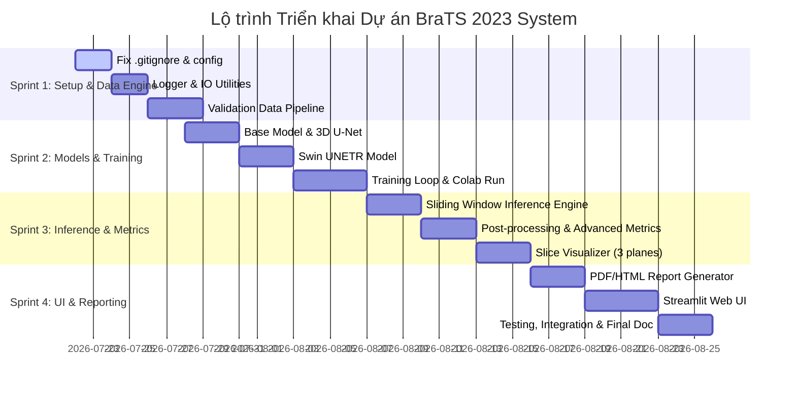

# HƯỚNG DẪN KẾ HOẠCH & PHÂN CÔNG NHIỆM VỤ DỰ ÁN (PROJECT PLAN & TEAM TASKS)
**Dự án:** Brain Tumor Segmentation Support System (BraTS 2023)  
**Phiên bản:** 1.0  
**Ngày lập:** 2026-07-22  

---

## 1. TỔNG QUAN DỰ ÁN & MỤC TIÊU (PROJECT OVERVIEW)

Hệ thống hỗ trợ bác sĩ và nhà nghiên cứu phân đoạn khối u não từ ảnh MRI 3D (định dạng NIfTI) sử dụng hai mô hình học sâu **3D U-Net** và **Swin UNETR**, cung cấp giao diện tương tác **Streamlit**, đánh giá các chỉ số (Dice, IoU, Precision, Recall, HD95, Volume) và xuất báo cáo tự động (PDF/HTML).

### Mục tiêu chính:
- **Tự động phân đoạn khối u** từ 4 chuỗi ảnh MRI (T1, T1ce, T2, FLAIR).
- **So sánh 2 mô hình**: U-Net vs Swin UNETR về độ chính xác và thời gian suy luận.
- **Tính toán thể tích khối u (cm³)** và hiển thị các lát cắt trực quan (Axial, Coronal, Sagittal).
- **Xuất báo cáo kết quả** chuyên nghiệp cho người dùng.

---

## 2. CẤU TRÚC THƯ MỤC DỰ ÁN HOÀN CHỈNH (DIRECTORY STRUCTURE)

Dưới đây là cấu trúc thư mục chuẩn hóa toàn bộ dự án. Ký hiệu:
- `[x]` : Đã có sẵn trong codebase.
- `[ ]` : Cần tạo mới / triển khai tiếp.

```text
SIC_Capstone 2026/
├── .gitignore                                # [x] Cần cập nhật (sửa lại để không ignore src/)
├── PRD.md                                    # [x] Tài liệu yêu cầu sản phẩm
├── doc.md                                    # [x] Tài liệu kiến trúc và luồng xử lý
├── PROJECT_PLAN_AND_TASKS.md                 # [ ] File kế hoạch & phân công nhiệm vụ cho team
├── requirements.txt                          # [ ] Khai báo thư viện phụ thuộc
├── README.md                                 # [ ] Hướng dẫn cài đặt và khởi chạy dự án
│
├── configs/                                  # [ ] Thư mục cấu hình hệ thống
│   └── default.yaml                          # [ ] File config thông số mô hình, đường dẫn, hyperparams
│
├── Datasets/                                 # [x] Bộ dữ liệu BraTS 2023
│   └── brats2023-gli-dataset/
│       └── ASNR-MICCAI-BraTS2023-GLI-Challenge-TrainingData/ # 100 cases MRI
│
├── checkpoints/                              # [ ] Thư mục lưu file weights (.pth / .pt)
│   ├── unet_brats_best.pth                   # [ ] Checkpoint 3D U-Net
│   └── swin_unetr_brats_best.pth             # [ ] Checkpoint Swin UNETR
│
├── results/                                  # [ ] Kết quả suy luận tạm thời / outputs
│   ├── masks/                                # [ ] NIfTI mask đầu ra
│   ├── overlays/                             # [ ] Ảnh PNG trực quan hóa
│   └── reports/                              # [ ] File PDF / HTML report
│
├── scripts/                                  # [ ] Scripts chạy huấn luyện độc lập
│   ├── train_unet.py                         # [ ] Script huấn luyện 3D U-Net
│   ├── train_swin_unetr.py                   # [ ] Script huấn luyện Swin UNETR
│   └── evaluate_models.py                    # [ ] Script đánh giá & so sánh 2 mô hình trên tập test
│
├── app/                                      # [ ] Giao diện Web UI (Streamlit)
│   ├── __init__.py                           # [ ]
│   ├── streamlit_app.py                      # [ ] Trang chính ứng dụng Streamlit
│   └── components/                           # [ ] Các UI component dùng lại
│       ├── __init__.py                       # [ ]
│       ├── sidebar.py                        # [ ] Thanh điều hướng, upload file, chọn model
│       ├── visualizer_ui.py                  # [ ] Component slider xem slices & overlay
│       └── report_ui.py                      # [ ] Component xem & tải báo cáo
│
└── src/                                      # [x] Mã nguồn cốt lõi (Core Backend Engine)
    ├── __init__.py                           # [ ]
    ├── config.py                             # [ ] Quản lý cấu hình toàn dự án
    │
    ├── data/                                 # [x] Module xử lý dữ liệu
    │   ├── __init__.py                       # [x] Export classes
    │   ├── data_loader.py                    # [x] Đọc NIfTI files & metadata
    │   ├── preprocessor.py                   # [x] Chuẩn hóa Z-score/min-max, Crop/Pad
    │   └── dataset.py                        # [x] PyTorch Dataset & DataSplitter
    │
    ├── models/                               # [ ] Module kiến trúc AI
    │   ├── __init__.py                       # [ ]
    │   ├── base_model.py                     # [ ] Base class quy định interface chuẩn của model
    │   ├── unet3d.py                         # [ ] Wrapper mô hình 3D U-Net (MONAI)
    │   └── swin_unetr.py                     # [ ] Wrapper mô hình Swin UNETR (MONAI)
    │
    ├── training/                             # [ ] Module huấn luyện
    │   ├── __init__.py                       # [ ]
    │   ├── trainer.py                        # [ ] Class SegmentationTrainer (AMP, Loss, Optim)
    │   ├── losses.py                         # [ ] DiceCELoss, FocalLoss
    │   └── augmentation.py                   # [ ] Pipeline biến đổi dữ liệu MONAI (Flip, Rotate, Crop)
    │
    ├── inference/                            # [ ] Module suy luận
    │   ├── __init__.py                       # [ ]
    │   ├── engine.py                         # [ ] InferenceEngine (Sliding window inference)
    │   ├── postprocessor.py                  # [ ] Morphological ops & Connected Components
    │   └── prediction_result.py              # [ ] Dataclass lưu trữ kết quả suy luận
    │
    ├── visualization/                        # [ ] Module trực quan hóa
    │   ├── __init__.py                       # [ ]
    │   ├── viewer.py                         # [ ] Trục cắt Axial/Coronal/Sagittal + Multi-color Overlay
    │   └── comparison.py                     # [ ] Đồ thị so sánh chỉ số giữa các mô hình
    │
    ├── reports/                              # [ ] Module tạo báo cáo
    │   ├── __init__.py                       # [ ]
    │   ├── generator.py                      # [ ] Tạo báo cáo PDF (dùng fpdf2)
    │   └── html_report.py                    # [ ] Tạo báo cáo HTML (Jinja2)
    │
    └── utils/                                # [x] Tiện ích chung
        ├── __init__.py                       # [ ]
        ├── metrics.py                        # [x] Tính Dice, IoU, Precision, Recall, HD95, Volume
        ├── logger.py                         # [ ] Logging thống nhất (Console + File)
        └── io.py                             # [ ] Đọc/ghi NIfTI, JSON, YAML utilities
```

---

## 3. PHÂN CÔNG CÔNG VIỆC CHI TIẾT THEO TEAM (TEAM TASK ASSIGNMENT)

Dự án được chia thành **4 Nhóm chuyên trách (Sub-teams)** với trách nhiệm rõ ràng:

### 🔹 TEAM 1: Data Pipeline & Infrastructure Setup
**Mục tiêu:** Hoàn thiện hạ tầng dự án, chuẩn hóa pipeline đọc/tiền xử lý dữ liệu và kiểm thử chất lượng dữ liệu đầu vào.
- **Tập file phụ trách:** `.gitignore`, `requirements.txt`, `src/config.py`, `src/data/*`, `src/utils/io.py`, `src/utils/logger.py`.
- **Nhiệm vụ chi tiết:**
  1. Cập nhật `.gitignore` (bỏ ignore `src/`, thêm `.venv`, `__pycache__`, `checkpoints/`).
  2. Tạo `requirements.txt` chuẩn hóa môi trường (`monai`, `torch`, `nibabel`, `streamlit`, `fpdf2`, v.v.).
  3. Cập nhật tương đối imports trong `src/data/dataset.py` (`from .data_loader import ...`).
  4. Viết `src/utils/logger.py` phục vụ ghi log quá trình chạy cho backend và UI.
  5. Viết `src/config.py` và `configs/default.yaml` quản lý tất cả cấu hình tham số.
  6. Viết script kiểm thử dữ liệu (Data Integrity Checklist) bảo đảm 100 cases trong `Datasets/` đều hợp lệ.

---

### 🔹 TEAM 2: Model Engineering & Training Pipeline
**Mục tiêu:** Xây dựng mô hình 3D U-Net & Swin UNETR, xây dựng luồng huấn luyện và xuất ra checkpoint tốt nhất.
- **Tập file phụ trách:** `src/models/*`, `src/training/*`, `scripts/train_unet.py`, `scripts/train_swin_unetr.py`.
- **Nhiệm vụ chi tiết:**
  1. Định nghĩa `src/models/base_model.py` để thống nhất interface (`forward`, `predict`, `load_weights`).
  2. Triển khai `src/models/unet3d.py` dựa trên kiến trúc MONAI `UNet`.
  3. Triển khai `src/models/swin_unetr.py` dựa trên kiến trúc MONAI `SwinUNETR` (hỗ trợ load weights pretrained từ MONAI Model Zoo).
  4. Triển khai `src/training/augmentation.py` với các MONAI Transforms (Crop spatial patch 128x128x128, Random Flip, Intensity scaling).
  5. Viết `src/training/trainer.py` hỗ trợ Mixed Precision (AMP), DiceCELoss, AdamW optimizer, validation loop và lưu checkpoint tốt nhất theo Dice score.
  6. Huấn luyện U-Net và Swin UNETR trên Google Colab / GPU local, lưu weights vào thư mục `checkpoints/`.

---

### 🔹 TEAM 3: Inference Engine, Post-processing & Metrics
**Mục tiêu:** Xây dựng bộ suy luận cho dữ liệu kích thước lớn, lọc nhiễu mask và tính toán chính xác các chỉ số y khoa.
- **Tập file phụ trách:** `src/inference/*`, `src/utils/metrics.py`.
- **Nhiệm vụ chi tiết:**
  1. Triển khai `src/inference/prediction_result.py` định nghĩa data structure chứa kết quả suy luận, mask, thời gian suy luận và chỉ số.
  2. Triển khai `src/inference/postprocessor.py` sử dụng thuật toán hình thái học (morphological operations) và lọc thành phần liên thông (connected component analysis) để khử nhiễu mask.
  3. Triển khai `src/inference/engine.py` sử dụng kỹ thuật **Sliding Window Inference** (của MONAI) để suy luận các volume MRI 3D kích thước lớn (240x240x155) mà không bị tràn RAM/VRAM.
  4. Cập nhật `src/utils/metrics.py`: nâng cấp tính toán HD95 chính xác theo khoảng cách Hausdorff 95% và hỗ trợ tính toán chỉ số cho từng vùng u (WT - Whole Tumor, TC - Tumor Core, ET - Enhancing Tumor).

---

### 🔹 TEAM 4: Visualization, Report Generator & Streamlit UI
**Mục tiêu:** Xây dựng bộ hiển thị lát cắt MRI 3D, xuất file báo cáo kết quả và xây dựng ứng dụng web tương tác hoàn chỉnh.
- **Tập file phụ trách:** `src/visualization/*`, `src/reports/*`, `app/*`.
- **Nhiệm vụ chi tiết:**
  1. Triển khai `src/visualization/viewer.py`: vẽ ảnh MRI 3D cắt theo 3 mặt phẳng (Axial, Coronal, Sagittal) đè màu mask phân đoạn (color-coded overlays).
  2. Triển khai `src/visualization/comparison.py`: vẽ biểu đồ cột/radar so sánh các chỉ số (Dice, IoU, Time) giữa U-Net và Swin UNETR.
  3. Triển khai `src/reports/generator.py`: tạo báo cáo PDF chuyên nghiệp (chứa thông tin bệnh nhân/case, ảnh lát cắt MRI, bảng chỉ số và thể tích khối u cm³).
  4. Triển khai `src/reports/html_report.py`: tạo phiên bản báo cáo HTML động.
  5. Triển khai `app/streamlit_app.py`:
     - Thanh Sidebar: Upload NIfTI file, chọn mô hình (U-Net / Swin UNETR / Both), bật/tắt post-processing.
     - Khu vực chính: Hiển thị thanh trượt Slice, xem ảnh 3 chiều, bảng thống kê chỉ số, thể tích khối u, so sánh 2 mô hình song song (side-by-side) và nút bấm Tải Báo Cáo.

---

## 4. LỘ TRÌNH TRIỂN KHAI THEO GIAI ĐOẠN (ROADMAP & TIMELINE)

Tổng thời gian dự kiến: **3 - 4 tuần** (chia thành 4 Sprints).



---

## 5. DANH SÁCH TASK CỤ THỂ THEO CHECKLIST (TASK CHECKLIST)

### Phase 1: Setup & Infrastructure
- [x] **Task 1.1:** Cập nhật `.gitignore` loại bỏ `src/` khỏi đường dẫn ignore.
- [x] **Task 1.2:** Tạo `requirements.txt` với đầy đủ các thư viện (`torch`, `monai`, `nibabel`, `streamlit`, `fpdf2`, `matplotlib`, `scipy`).
- [x] **Task 1.3:** Sửa relative import trong `src/data/dataset.py`.
- [x] **Task 1.4:** Triển khai `src/utils/logger.py` và `src/utils/io.py`.
- [x] **Task 1.5:** Triển khai `src/config.py` và `configs/default.yaml`.


### Phase 2: Core Models & Training
- [x] **Task 2.1:** Viết `src/models/base_model.py` chuẩn hóa Interface.
- [x] **Task 2.2:** Triển khai `src/models/unet3d.py` bằng MONAI UNet.
- [x] **Task 2.3:** Triển khai `src/models/swin_unetr.py` bằng MONAI SwinUNETR.
- [x] **Task 2.4:** Xây dựng Data Augmentation trong `src/training/augmentation.py`.
- [x] **Task 2.5:** Xây dựng `src/training/trainer.py` (AMP, DiceCELoss, Model Checkpointing).
- [x] **Task 2.6:** Tạo `scripts/train_unet.py` và `scripts/train_swin_unetr.py` để chạy huấn luyện trên Colab/GPU.
- [x] **Task 2.7:** Chuẩn bị sẵn cơ chế lưu checkpoint xuất sắc nhất vào thư mục `checkpoints/`.


### Phase 3: Inference & Visualization Engine
- [x] **Task 3.1:** Định nghĩa dataclass `src/inference/prediction_result.py`.
- [x] **Task 3.2:** Triển khai `src/inference/postprocessor.py` khử nhiễu mask.
- [x] **Task 3.3:** Viết `src/inference/engine.py` thực hiện Sliding Window Inference 3D.
- [x] **Task 3.4:** Cập nhật `src/utils/metrics.py` (bổ sung HD95 chuẩn & metrics theo từng vùng u: WT, TC, ET).
- [x] **Task 3.5:** Viết `src/visualization/viewer.py` hiển thị lát cắt 3 trục + mask overlay.
- [x] **Task 3.6:** Viết `src/visualization/comparison.py` tạo biểu đồ so sánh 2 mô hình.


### Phase 4: Reporting, Web UI & Integration
- [ ] **Task 4.1:** Triển khai `src/reports/generator.py` xuất báo cáo PDF.
- [ ] **Task 4.2:** Triển khai `src/reports/html_report.py` xuất báo cáo HTML.
- [ ] **Task 4.3:** Xây dựng giao diện `app/streamlit_app.py` kết nối đầy đủ pipeline: Upload -> Preprocess -> Inference -> Visualization -> Export.
- [ ] **Task 4.4:** Kiểm thử toàn bộ hệ thống (End-to-End Test): Đảm bảo thời gian suy luận < 2 phút/case và Dice score validation đạt chỉ tiêu PRD (≥ 0.6).
- [ ] **Task 4.5:** Viết file `README.md` hoàn chỉnh hướng dẫn team/người dùng cài đặt và khởi chạy.

---

## 6. QUY TRÌNH PHỐI HỢP & DRAFT DEFINITION OF DONE (DoD)

### Git Workflow:
- Branch chính: `main` (hoặc `master`).
- Các branch tính năng đặt tên theo format: `feature/team<X>-<task-name>` (Ví dụ: `feature/team2-unet3d`, `feature/team4-streamlit-ui`).
- Mọi Pull Request (PR) phải được ít nhất 1 thành viên khác review trước khi merge vào branch chính.

### Tiêu chuẩn hoàn thành (Definition of Done - DoD):
1. **Code Quality:** Không có lỗi syntax/import, tuân thủ chuẩn mã nguồn Python PEP8.
2. **Unit / Integration Testing:** Kiểm tra module chạy được trên ít nhất 1 case mẫu (`BraTS-GLI-00000-000`).
3. **Documentation:** Có docstring giải thích hàm/class đầy đủ.

---

## 7. HƯỚNG DẪN BẮT ĐẦU DÀNH CHO TEAM (GETTING STARTED)

1. **Clone repository & tạo môi trường ảo:**
   ```bash
   git clone <repository_url>
   cd "SIC_Capstone 2026"
   python -m venv .venv
   # Trực quan trên Windows PowerShell:
   .\.venv\Scripts\Activate.ps1
   ```

2. **Cài đặt các thư viện cần thiết:**
   ```bash
   pip install -r requirements.txt
   ```

3. **Kiểm tra chạy thử dữ liệu:**
   ```bash
   python -c "from src.data import BraTSDataLoader; dl = BraTSDataLoader('Datasets/brats2023-gli-dataset/ASNR-MICCAI-BraTS2023-GLI-Challenge-TrainingData'); print(f'Số lượng cases: {len(dl.list_cases())}')"
   ```

4. **Chạy giao diện Web Demo (sau khi làm xong Sprint 4):**
   ```bash
   streamlit run app/streamlit_app.py
   ```
